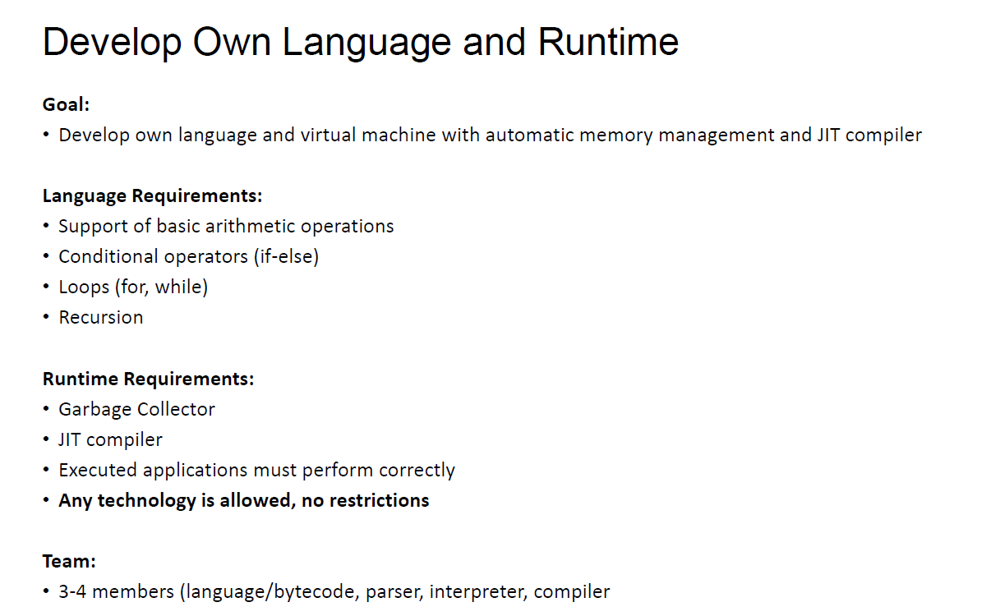
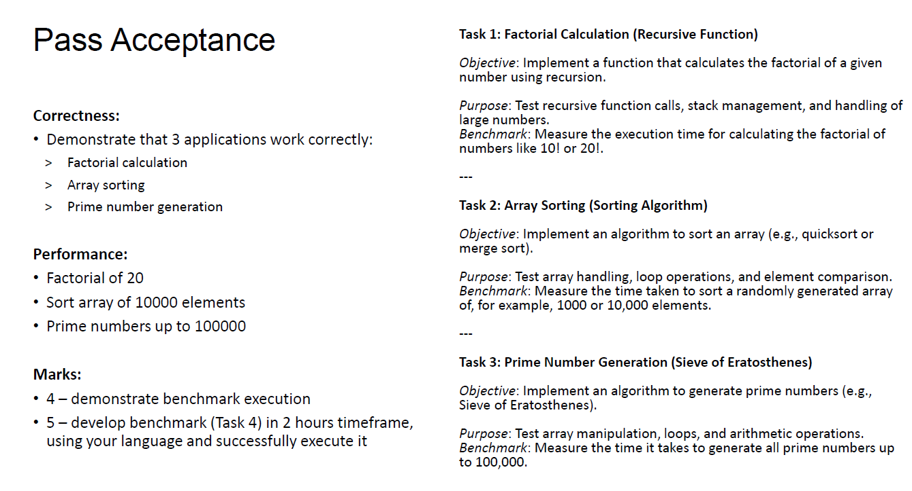
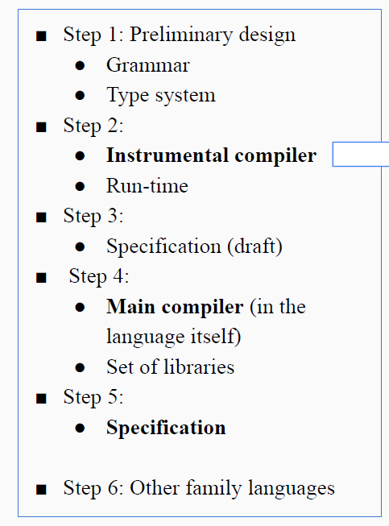

# twin-peaks-programming-language
twin peaks programming language

Требования:

Объявление переменных
```
    <identifier> type;
```

Присвание значения
```
    <identifier> = value;
```

Унарные Операции с перменными
```
    "!", "-", "*", "&"
```

Бинарные Операции с перменными
```
    "+", "-", "*", "/", "%"
```

## Базовые конструкции
Условные выржания
```
    if (expr) {
    
    } else if  {
    
    } else {
    
    };
```

Цикл for 
```
   for (runOnce : exitCondition : runLoop) {

   };
```

## Функции
Определение функции (обязательно до использования)
```
    fn name(type args...)<returnType> {return (optional)};
```

```
    name(args...);
```

## Массивы
Объявление массива
```
    <identifier>[N]type;
```

```
    <identifier>[x] = value;
    
    <other_identifier> = <identifier>[x];
```

## Указатели
```
    <identifier> *type;
    
    *<identifier> = value;
    
    <indetifier> = &value;
```





План:


